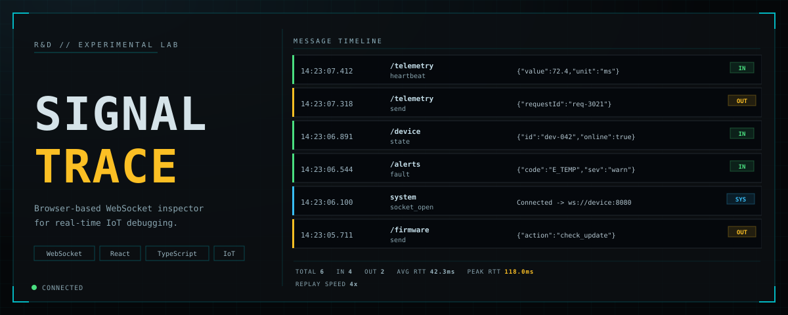

# Signal Trace

Signal Trace is a browser-based WebSocket traffic inspector for real-time IoT debugging.
It helps you connect to a WebSocket endpoint, inspect inbound/outbound messages, validate payloads against a simple schema, and replay/export traffic timelines.

## Tech Stack
- React 19
- TypeScript
- Vite

## Features
- Live WebSocket connect/disconnect workflow
- Protocol decode modes (`auto`, `raw`, `socket.io`)
- Traffic timeline with direction, namespace, event, payload, bytes, and latency
- Search (in timeline header) and namespace filtering
- Visual Schema Guard constructor (modal) for outgoing payload validation
- Timeline import/export (`JSON` and `NDJSON`)
- Timeline replay with speed controls
- Demo mode for local experimentation

## Requirements
- Node.js 20+ (recommended current LTS)
- npm 10+

## Getting Started
1. Install dependencies:
   ```bash
   npm install
   ```
2. Start development server:
   ```bash
   npm run dev
   ```
3. Open the local URL shown in terminal (typically `http://localhost:5173`).

## Available Scripts
- `npm run dev` - Start Vite dev server
- `npm run build` - Type-check and build production assets
- `npm run preview` - Preview the production build locally
- `npm run test` - Run tests in watch mode
- `npm run test:run` - Run all tests once

## Basic Usage
1. Set WebSocket URL (default: `ws://localhost:8080`).
2. Choose protocol mode (`auto` is recommended initially).
3. Click **Connect**.
4. Inspect incoming/outgoing traffic in the timeline.
5. Use timeline search and namespace filters to narrow results.
6. Optionally validate outgoing JSON payloads with the schema panel.
7. Export or replay timeline data as needed.

### Socket.IO Auth Handshake
If your backend uses Socket.IO namespaces/auth:
- Enable **Socket.IO Handshake**.
- Set **Socket.IO Path** (commonly `/socket.io` or `/ws`).
- Set **Socket.IO Namespace** (for example `/devices` or `/frontend`).
- Provide **Socket.IO Auth JSON** when required (for example `{"serial":"...","token":"..."}`).
- Use protocol mode `socketio` to send event frames, and set **Socket.IO Event** if you need an event name other than `trace`.
- Signal Trace waits for namespace connection before allowing Socket.IO sends.
- Engine.IO ping (`2`) is handled automatically with pong (`3`) keepalive replies.

### Repeated Sends To `bewf`
When sending multiple messages to `bewf`, keep **Auto-refresh id/timestamp** enabled in the **Transmit** panel.
This updates top-level `id` and `timestamp` on each send and helps avoid backend event key collisions when re-sending the same payload.

Recommended `bewf` transmit settings:
- **Protocol Decode**: `socketio`
- **Socket.IO Namespace**: `/devices`
- **Socket.IO Event**: `device_telemetry`

### Schema Guard Builder
- Open **Schema Guard** from the sidebar and click **Open Schema Builder**.
- Add fields with type (`string`, `number`, `boolean`, `object`, `array`).
- Use the **Required** checkbox next to each field to mark it required.
- Leave all fields empty to disable schema validation.

## Testing
Current test suite covers:
- Socket.IO URL/auth/namespace utility behavior
- Frame decoding and schema-validation utility behavior
- Core UI flows (schema modal, validation errors, Socket.IO send guards, handshake lifecycle)

## Project Structure
```text
.
├── src/
│   ├── App.tsx       # Main inspector UI + runtime logic
│   ├── main.tsx      # App bootstrap
│   └── styles.css    # Styling
├── index.html
├── package.json
└── AGENTS.md
```

## Notes
- This project includes a Vitest + Testing Library test suite (`npm run test:run`).
- If your endpoint is unavailable, use Demo mode to test the UI behavior.
